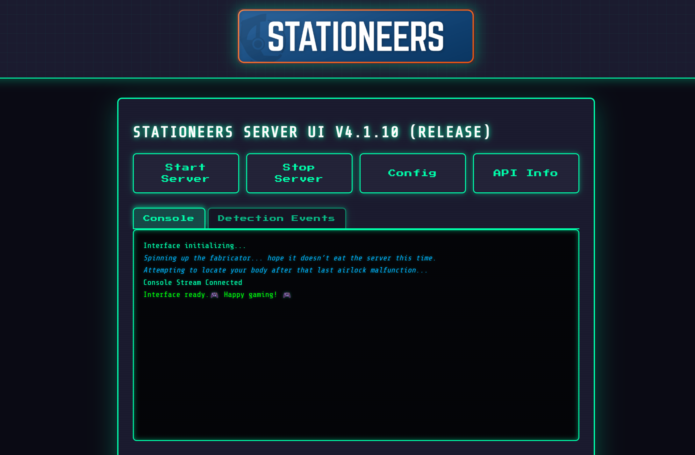
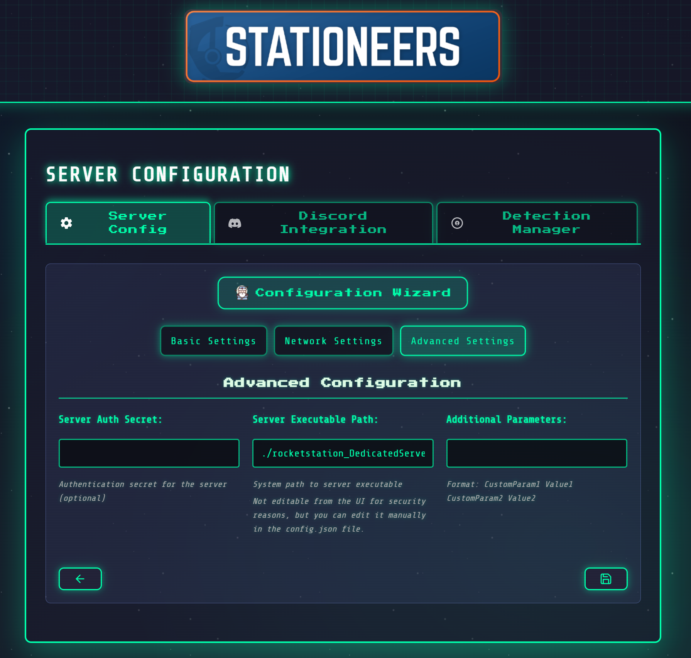
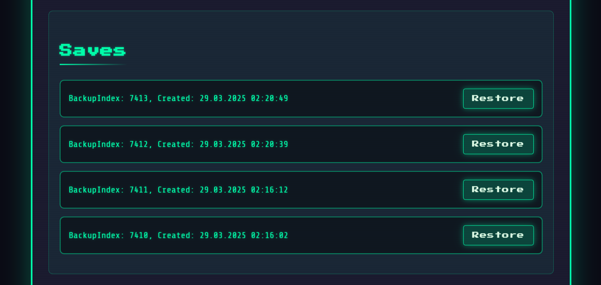
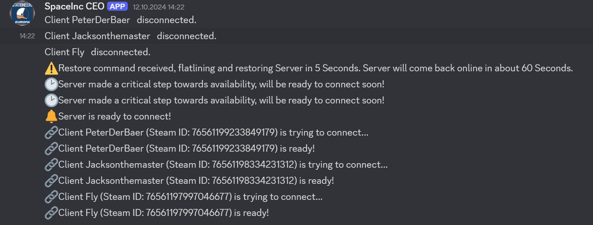
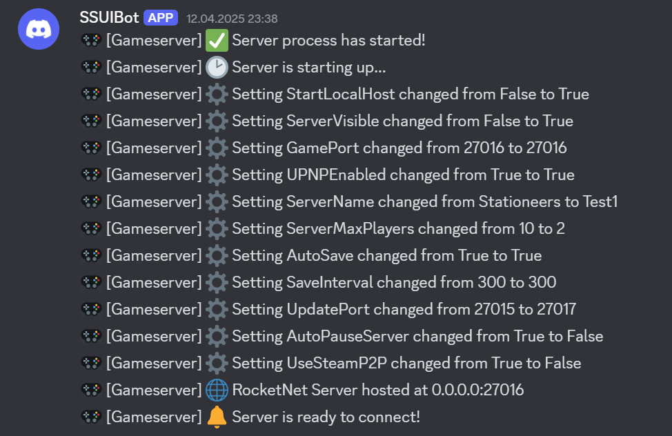
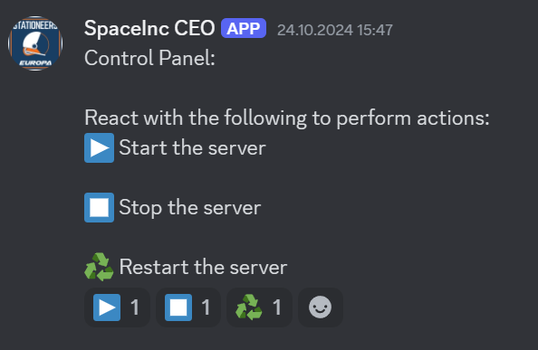
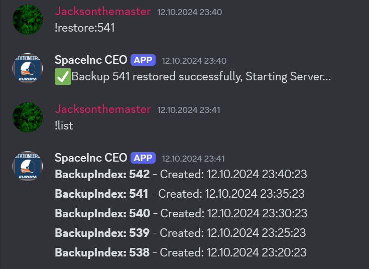

# Stationeers Server UI

## ✨ Feature Showcase ✨

| 🚀 Easy Setup | Secure by Default | 🔄 Auto Updates | 🎮 Easy Control | 💾 Smart Backups | 🤖 Discord Bot | 🛠️ Command Manager | 🧩 Mod Support | 
|:-------------:|:-----------------:|:---------------:|:----------------:|:----------------:|:--------------:|:------------------:|:-------------:|
| Just run and go | JWT auth, TLS | Gameserver updates at startup | One-click management | Automated system | Remote control | Execute server commands | BepInEx integration |

### 🌟 Live UI Preview 🌟

Explore your fututre Stationeers Server UI in action—no setup required!
And the "best part?" The Demo current is not on the V5 but V4, so if you are convinced by the Demo, it will only get better when you actually try it out!

  
  
  <em>Manage your Stationeers server with style - Retro interface, modern capabilities.</em>

### New Power Features

- 🛠️ **Stationeers Server Command Manager Mod** - Execute server commands directly through the UI or API
- 🧩 **BepInEx Integration** - Automatic setup of the popular modding framework

## TL;DR - Get Started Fast

1. 📦 Download latest executable from [here](https://github.com/JacksonTheMaster/StationeersServerUI/releases)
2. 📁 Place in empty folder and run it on Linux or Windows (chmod +x on linux)
3. 🌐 Access UI at `https://<<server-ip>>:8443`
4. 📚 See [First-Time Setup](https://github.com/JacksonTheMaster/StationeersServerUI/wiki/First-Time-Setup) in the wiki
5. 🔒 If you set this up too quickly and are in search of the Default Username/Password, see [Security Considerations](https://github.com/JacksonTheMaster/StationeersServerUI/wiki/Security-Considerations) for more details!

## What is This?

A sleek, retro-themed web UI to manage your Stationeers dedicated server. No more command line headaches or manual file editing!

### Why You'll Love It

- 🚀 **Zero Config Setup** - Place in empty folder and run
- 🔌 **Auto SteamCMD Setup** - No manual installation required
- 🔄 **Auto Updates** - Server and Management UI update automatically at startup
- 🎮 **One-Click Controls** - Start/stop server or restore backups with simple buttons
- 💾 **Smart Backups** - Automated backup system with easy restore
- 🤖 **Discord Integration** - Control your server through Discord
- 🔒 **Secure by Default** - JWT auth, TLS, and randomized JWT key
- 🛠️ **Command Manager** - Execute server commands directly from the UI (and soon discord!)
- 🧩 **Beta: Mod Support** - Support for BepInEx mods (currently in beta, be careful!)
- 📦 **Docker Support** - Runs in Docker containers

## Detailed Documentation

For comprehensive instructions, examples, and more details, visit our [GitHub Wiki](https://github.com/JacksonTheMaster/StationeersServerUI/wiki).

| Documentation Section | Description |
|----------------------|-------------|
| [Features](https://github.com/JacksonTheMaster/StationeersServerUI/wiki/Features) | Complete list of features and capabilities |
| [Requirements](https://github.com/JacksonTheMaster/StationeersServerUI/wiki/Requirements) | System requirements and prerequisites |
| [Installation](https://github.com/JacksonTheMaster/StationeersServerUI/wiki/Installation) | Step-by-step installation guide |
| [First-Time Setup](https://github.com/JacksonTheMaster/StationeersServerUI/wiki/First-Time-Setup) | Getting your server up and running |
| [Discord Integration](https://github.com/JacksonTheMaster/StationeersServerUI/wiki/Discord-Integration) | Setting up and using Discord features |
| [Web Interface](https://github.com/JacksonTheMaster/StationeersServerUI/wiki/Web-Interface) | Using the web UI effectively |
| [Docker Guide](https://github.com/JacksonTheMaster/StationeersServerUI/wiki/Docker-Guide) | Running in Docker containers |
| [Security Considerations](https://github.com/JacksonTheMaster/StationeersServerUI/wiki/Security-Considerations) | Important security best practices |

## Web UI Preview

_Click the images to expand them._

| UI Overview | Configuration | Backup Management |
|:-----------:|:-------------:|:-----------------:|
|  |  |  |

## Discord Preview

_Click the images to expand them._

| Connection Log | Save Log | Panel | Discord Commands |
|:-----------:|:-------------:|:-----------------:|:-------------:|
|  |  |  |  |

## Contributing

Love this project? I'd love your help making it better! See the [Contributing Guidelines](https://github.com/JacksonTheMaster/StationeersServerUI/wiki/Contributing) to get started.

- 🐛 **Found a bug?** [Open an issue](https://github.com/JacksonTheMaster/StationeesServerUI/issues)
- 💡 **Have an idea?** [Suggest a feature](https://github.com/JacksonTheMaster/StationeesServerUI/issues/new?labels=enhancement)
- 🤔 **Questions?** [Check the Wiki](https://github.com/JacksonTheMaster/StationeesServerUI/wiki) or [open a topic](https://github.com/JacksonTheMaster/StationeesServerUI/issues/new?labels=question).

## License

This project is licensed under the STATIONEERS SERVER UI LICENSE AGREEMENT - see the [LICENSE](LICENSE) file for details.
