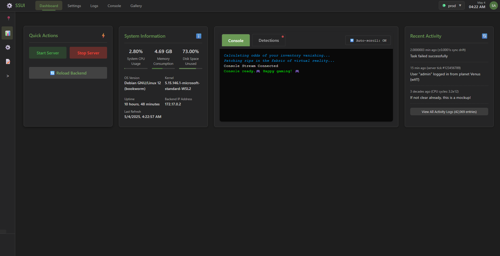
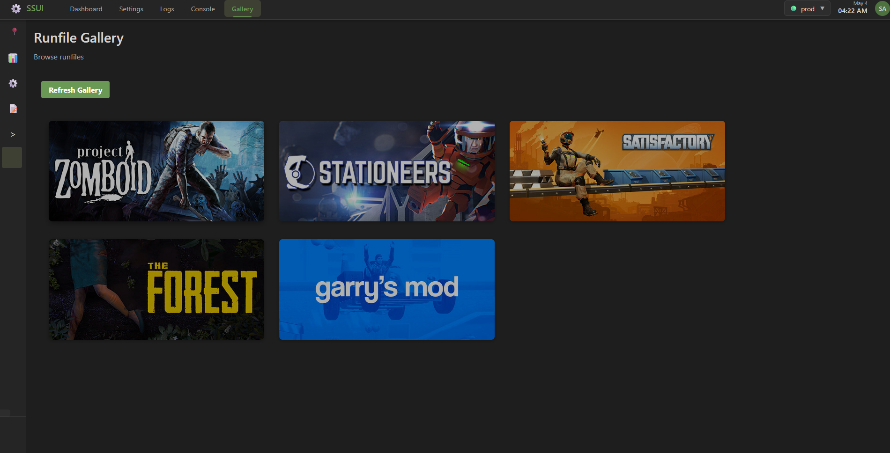

> [!IMPORTANT]
> This project is licensed under the SSUI [LICENSE](LICENSE) and does NOT allow redistribution.
> Instead of forking, join the [Discord](https://discord.gg/8n3vN92MyJ) and state your intentions or [Open an issue](https://github.com/SteamServerUI/SteamServerUI/issues).

# SteamServerUI - Your One-Stop Shop for Steam Server Shenanigans

> [!CAUTION]
> v6 of SSUI is a work in progress and is **not** recommended for production use, but technically feasible.
> Development of v6 will continue over the next months. My _plan_ is to have a full release by the end of Q3 2025.

## 🚀 From Stationeers to Steam: The Great Servervolution

Once upon a time, I built **SteamServerUI** (SSUI), a sleek, retro-themed UI to tame the wild beast that a Stationeers dedicated server is. It is glorious—automatic SteamCMD setups, one-click controls, Discord bots, and a backup system smarter than your average space engineer. But then, @mitoskalandiel dropped a galaxy-sized idea: *Why stop at Stationeers?* Why not make SSUI the ultimate overlord of *any* Steam server? And so, **SteamServerUI** was born, with @JacksonTheMaster and @mitoskalandiel leading the charge to generalize the chaos of server management.

**SteamServerUI (v6)** is the shiny, in-development evolution of [StationeersServerUI](https://github.com/SteamServerUI/StationeersServerUI), designed to run *any* Steam game server. Think Satisfactory, Project Zomboid, Stationeers, or even that obscure indie game you love! 

> ⚠️ **Warning**: v6 is a *preview*. It’s like a prototype spaceship — cool, but expect a lot of loose bolts. This tool is *currently* meant for development, not production. Some remains of Stationeers-specific features (like BackupManager and Discord) are currently in a state of… let’s call it “creative flux.” Non-breaking, but they complain with some noise.

### Games We’ve Tested (So Far)
- 🏭 **Satisfactory**: Build factories, crash servers, repeat.
- 🚀 **Stationeers**: Space is hard, server management isn’t.
- 🧟 **Project Zomboid**: Survive zombies, not server crashes.
- …or *any* SteamCMD game, if you’re brave enough to write the runfile yourself!

Check out the [List of supported games](https://github.com/SteamServerUI/SteamServerUI/wiki/Supported-Games) for more information.

## 🛠️ The Runfile: Heart of SteamServerUI

The `runfile` is a JSON file that defines how to run a game server. It specifies the game’s Steam App ID, executables, and command-line arguments, which SteamServerUI uses to launch and manage the server. 

If you are curious for more information, see the [runfile documentation](https://github.com/SteamServerUI/SteamServerUI/wiki/What-is-a-runfile%3F).

## 🌟 Features Currently Implemented 🌟

| 🚀 Zero Config | 🔄 Auto Updates | 🎮 One-Click Control | 🔒 Secure by Default | 🛠️ Mod Support |
|:-------------:|:---------------:|:-------------------:|:-------------------:|:--------------------:|
| Drop and run | SteamCMD updates | Start/stop with ease | JWT auth, TLS | BepInEx integration |

> **Note**: v6 is a work in progress. It currently IS able to run a Server successfully in a playable state, but is not recommended for production use. Though, technically feasible. 

## TL;DR - Get Started (If You Dare)

1. 📦 Grab the v6 branch with a git clone
2. 📁 build the project with `go build build/build.go` and copy the executable of your system to the root of the project (chmod +x) and execute it.
3. 🐋 Or, use docker! As there is no Stable Release atm, you can use the docker image from the [Docker Hub](https://hub.docker.com/r/steamserverui/steamserverui) or build it yourself with the provided [Dockerfile](Dockerfile).
4. 🌐 Access the UI at `https://<<server-ip>>:8443`.

## Why You’ll (Eventually) Love It

- **Generalized Power**: One UI to rule *all* Steam servers (with the right runfile).
- **Community-Driven**: Built by @JacksonTheMaster, inspired by @mitoskalandiel, and all open to your ideas. 

## 🗺️ Documentation (v6)

There is currently NO real documentation for version 6.
Earlier versions are documented in the [StationeersServerUI Wiki](https://github.com/SteamServerUI/StationeersServerUI/wiki).

## 🙌 Contributing

> [!IMPORTANT]
> This project is licensed under the SSUI [LICENSE](LICENSE) and does NOT allow redistribution.
> Instead of forking, join the [Discord](https://discord.gg/8n3vN92MyJ) and state your intentions or [Open an issue](https://github.com/SteamServerUI/SteamServerUI/issues).

SteamServerUI is a community effort, and we’d love your input (but no pressure). Got a bug? [Open an issue](https://github.com/SteamServerUI/SteamServerUI/issues). Got a runfile for your favorite game? Share it! See the [Contributing Guidelines](https://github.com/SteamServerUI/SteamServerUI/wiki/Contributing) for details.
The License is here to protect this project, not to scare you away.

Special thanks to:
- **@mitoskalandiel**: For the galaxy-brain idea to go beyond Stationeers, and providing me with a powerful Linux Server to test on!

## 📜 License

This project is licensed under the STEAM SERVER UI LICENSE AGREEMENT - see the [LICENSE](LICENSE) file for details.

Cleared 400MB of Executables from the Git History on 17.05.2025
