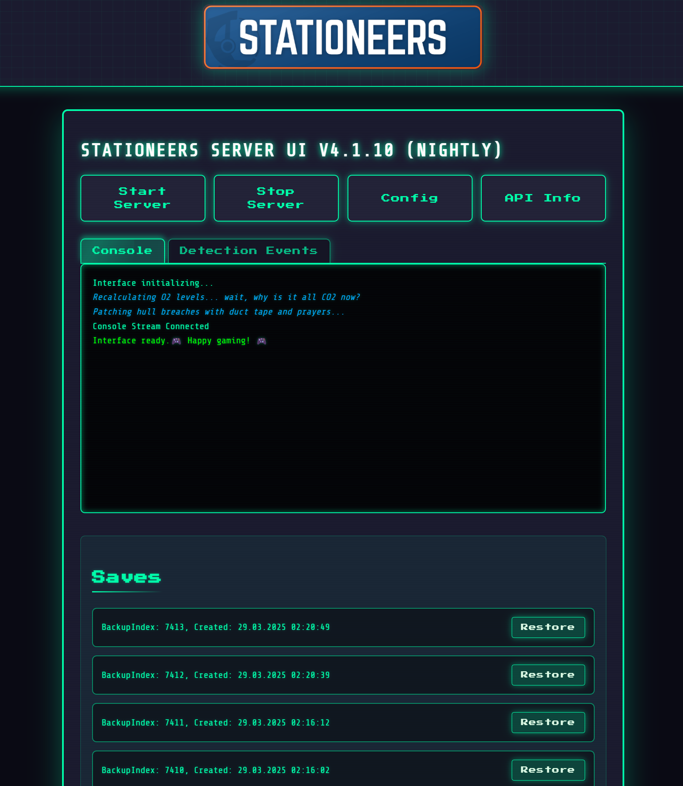

# Stationeers Dedicated Server Control v2.4.X


| UI Overview | Configuration | Backup Management |
|:-----------:|:-------------:|:-----------------:|
|  |  |  |

## Introduction

Stationeers Dedicated Server Control is a user-friendly, web-based tool for managing a Stationeers dedicated server. It features an intuitive retro computer-themed interface, allowing you to easily start and stop the server, view real-time server output, manage configurations, and handle backups—all from your web browser.

Additionally, it offers full Discord integration, enabling you and your community to monitor and manage the server directly from a Discord server. Features include real-time server status updates, console output, and the ability to start, stop, and restore backups via Discord commands.

**Important:** For security reasons, do not expose this UI directly to the internet without a secure authentication mechanism. Do not port forward the UI directly.

Special thanks to @mitoskalandiel for adding Linux and Docker support!

### Linux & Docker DISCLAIMER: (March 2025)

This software got a rework to support Linux, and while it is technically possible to run it on Linux, there is a culprit:

**The Stationeers Server Linux builds** are having a rough time right now. Stable’s struggling to start, and beta launches but stumbles on save loading. We suspect an issue with RocketWerkZ build pipeline at the moment and hope to see this resolved soon. Aside from this, StationeersSeverUI's Linux builds are suspected stable at the moment and would be ready to go.

## Table of Contents

- [Stationeers Dedicated Server Control v2.4.1](#stationeers-dedicated-server-control-v241)
  - [Known Bug](#known-bug)
  - [Introduction](#introduction)
  - [Table of Contents](#table-of-contents)
  - [Features](#features)
  - [Requirements](#requirements)
  - [Installation](#installation)
    - [Quick Installation Instructions](#quick-installation-instructions)
  - [First-Time Setup](#first-time-setup)
  - [Discord Integration](#discord-integration)
    - [Discord Integration Features](#discord-integration-features)
    - [Discord Notifications](#discord-notifications)
  - [Discord Integration Setup](#discord-integration-setup)
  - [Usage](#usage)
    - [Web Interface](#web-interface)
      - [Discord Commands](#discord-commands)
  - [Running with Docker](#running-with-docker)
    - [Building your own Docker Image](#building-your-own-docker-image)
  - [Running with Docker Compose from your own image](#running-with-docker-compose-from-your-own-image)
  - [Using the Docker Image from GitHub Container Registry](#using-the-docker-image-from-github-container-registry)
  - [Using the Docker Image from GitHub Container Registry](#using-the-docker-image-from-github-container-registry-1)
  - [Important Security Note](#important-security-note)
  - [Important Notes](#important-notes)
  - [License](#license)
  - [Contributing](#contributing)
    - [Branching Strategy](#branching-strategy)
    - [Versioning](#versioning)
    - [How You Can Jump In](#how-you-can-jump-in)
  - [Acknowledgments](#acknowledgments)

## Features
- Place Executable in an Empty folder and run it, Stationeers Server ready.
- Auto Update the Server at Software Startup
- Auto SteamCMD Setup
- Start and stop the Stationeers server with ease.
- View real-time server console output.
- Manage server configurations through a user-friendly interface.
- List and restore backups, with enhanced backup management features.
- Fully functional REST API for advanced operations (optional).
- Full Discord integration for server monitoring and management.
- Auto Deletion of Backups older than 2 days.

## Requirements

- Windows OS (tested on Windows; Linux support experimental).
- Administrative privileges on the server machine.
  - (Root/sudo access required to install steamcmd pre-requirements on linux)
- An empty folder of your choice to install the server control software.

## Installation

### Quick Installation Instructions

1. **Download and Run the Application**

   - Download the latest release executable file (`.exe`) from the [releases page](https://github.com/JacksonTheMaster/StationeersServerUI/releases).
   - Place it in an empty folder of your choice.
   - Run the executable. A console window will open, displaying output.

2. **Access the Web Interface**

   - Open your web browser.
   - Navigate to `http://<IP-OF-YOUR-SERVER>:8080`.
     - Replace `<IP-OF-YOUR-SERVER>` with the local IP address of your server. You can find this by opening Command Prompt and typing `ipconfig`.

3. **Allow External Connections (Optional)**

   - If you want others on your network to access the server UI or the gameserver, you'll need to adjust your Windows Firewall settings:
     - Go to **Control Panel > System and Security > Windows Defender Firewall**.
     - Click on **Advanced settings**.
     - Select **Inbound Rules** and click on **New Rule...**.
     - Choose **Port** and click **Next**.
     - for the gameserver, select **TCP** and enter `27015, 27016` in the **Specific local ports** field.
     - for the WebUI(This Software), select **TCP** and enter `8080` in the **Specific local ports** field.
     - Click **Next**.
     - Choose **Allow the connection** and click **Next**.
     - Select the network profiles of your choise (Domain, Private, Public) and click **Next**.
     - Name the rule (e.g., "Stationeers Server Ports") and click **Finish**.
   - **Note:** Depending on your network setup, you may need to configure port forwarding on your router to allow external connections. Please refer to your router's documentation for instructions.


## First-Time Setup

To successfully run the server for the first time, follow these steps:
Follow the Installation Instructions above.
Only turn to this section when the magenta Text in the Console tells you to do so.

1. **Prepare Your Save File**

   - Copy an existing Stationeers save folder into the `/saves` directory created during the installation.

2. **Configure the Save File Name**

- In the web interface, click on the **Config** button.
- Enter the name of your save folder in the **Save File Name** field.
- More parameters can be added in the **Additional Parameters** field (see "Additional Parameters" section below).
- You might restart the Software at this point to be sure, but it's technically not necessary.

<details>
<summary>[EXTEND]The following parameters can be added to the **Additional Parameters** field:</summary>

- `get_Path`
- `set_Path`
- `Save`
- `Load`
- `Equals`
- `GetHashCode`
- `GetType`
- `ToString`
- `.ctor`
- `Path`
- `SettingsVersion`
- `ShowFps`
- `ShowLatency`
- `AutoSave`
- `SaveInterval`
- `SavePath`
- `HUDScale`
- `TooltipOpacity`
- `IngamePortrait`
- `ExtendedTooltips`
- `ChatFadeTimer`
- `DayLength`
- `LegacyInventory`
- `ShowSlotToolTips`
- `DeleteSkeletonOnDecay`
- `Monitor`
- `ScreenWidth`
- `ScreenHeight`
- `RefreshRate`
- `GraphicQuality`
- `TextureQuality`
- `FullScreen`
- `Vsync`
- `Shadows`
- `ShadowResolution`
- `ShadowDistance`
- `LightShadowDistance`
- `RoomControlTickSpeed`
- `ShadowNearPlaneOffset`
- `ShadowCascades`
- `ThingShadowMode`
- `ThingShadowDistanceMultiplier`
- `RenderDistance`
- `WorldOrigin`
- `Brightness`
- `FieldOfView`
- `ColorBlind`
- `ParticleQuality`
- `SoftParticles`
- `EnvironmentElements`
- `ExtendedTerrain`
- `VolumeLight`
- `PixelLightCount`
- `MaxThingLights`
- `Antialiasing`
- `FrameLock`
- `AtmosphericScattering`
- `AmbientOcclusion`
- `LensFlares`
- `ChunkRenderDistance`
- `MineableRenderDistance`
- `DisableWaterVisualizer`
- `Clouds`
- `HelmetOverlay`
- `WeatherEventQuality`
- `MasterVolume`
- `SoundVolume`
- `VoiceNotificationVolume`
- `MusicVolume`
- `InterfaceVolume`
- `VirtualVoices`
- `RealVoices`
- `UserSpeakerMode`
- `ServerName`
- `StartLocalHost`
- `ServerVisible`
- `ServerPassword`
- `AdminPassword`
- `ServerAuthSecret`
- `ServerMaxPlayers`
- `UpdatePort`
- `GamePort`
- `UPNPEnabled`
- `UseSteamP2P`
- `DisconnectTimeout`
- `NetworkDebugFrequency`
- `LocalIpAddress`
- `AutoPauseServer`
- `LanguageCode`
- `VoiceLanguageCode`
- `Voice`
- `PopupChat`
- `CameraSensitivity`
- `KeyList`
- `InvertMouse`
- `InvertMouseWheelInventory`
- `MenuLite`
- `MouseWheelZoom`
- `FirstRun`
- `VoiceNotifications`
- `CompletedTutorials`
- `CompletedScenarios`
- `DisplayHelperHints`
- `AutoExpandHelperHints`
- `VerticalMovementAxis`
- `HorizontalMovementAxis`
- `ForwardMovementAxis`
- `VerticalLookAxis`
- `HorizontalLookAxis`
- `UseCustomWorkThreadsCount`
- `MinWorkerThreads`
- `MinCompletionPortThreads`
- `MaxWorkerThreads`
- `MaxCompletionPortThreads`
- `CoroutineTimeBudget`
- `SmoothTerrain`
- `SmoothTerrainAngle`
- `ConsoleBufferSize`
- `LegacyCpu`
</details>


3. **Start the Server**

   - Return to the main page of the web interface.
   - Click on the **Start Server** button.
   - The server will begin to start up, and you can monitor the console output in real-time.

## Discord Integration

### Discord Integration Features

- **Real-Time Monitoring:**
  - View server status and console output directly in Discord.
  - Receive notifications for server events such as player connections/disconnections, exceptions, and errors.
- **Server Management Commands:**
  - Start, stop, and restart the server.
  - Restore backups.
  - Ban and unban players by their Steam ID.
  - Update server files (currently supports the stable branch only).
- **Access Control:**
  - Utilize Discord's role system for granular access control over server management commands and notifications.

### Discord Notifications

The bot can send notifications for the following events:

- **Server Ready:** Notifies when the server status changes to ready.
- **Player Connection/Disconnection:** Alerts when a player connects or disconnects.
- **Exceptions and Errors:** Sends notifications when exceptions or errors are detected, including Cysharp error detection.
- **Player List:** Provides a table of connected players and their Steam IDs.

## Discord Integration Setup

1. **Create a Discord Bot**

   - Follow the instructions on [Discord's Developer Portal](https://discord.com/developers/applications) to create a new bot and add it to your Discord server.

2. **Obtain the Bot Token**

   - In the bot settings, under the **Bot** tab, copy the **Token**. Keep this token secure.

3. **Configure the Bot in the Server Control UI**

   - In the web interface, click on the **Further Setup** button.
   - Enter the bot's token in the **Discord Token** field.
   - Create a Discord Server if not already done.
   - Create a Discord Channel for the Server Control (commands), Server Status, and Server Log, and the Control Panel. Additionally, create a Discord Channel for the Error Channel.

   - Input the **Channel IDs** on the further Setup Page.
     - **Server Control Channel ID**: For sending commands to the bot.
     - **Server Status Channel ID**: For receiving server status notifications.
     - **Server Log Channel ID**: For viewing real-time console output.
     - **Control Panel Channel ID**: For the Control Panel.
     - **Error Channel ID**: For the Error Channel.
   - **Note:** To get a channel's ID, right-click on the channel in Discord and select **Copy ID**.

4. **Enable Discord Integration**

   - In the **Further Setup** page, check the **Discord Enabled** checkbox.

5. **Restart the Application**

   - Close the application and run the executable again to apply the changes.

## Usage

### Web Interface

- **Start/Stop Server:** Use the **Start Server** and **Stop Server** buttons on the main page.
- **View Server Output:** Monitor real-time console output directly in the web interface.
- **Manage Configurations:**
  - Click on the **Config** button to edit server settings.
  - Ensure all settings are correct before starting the server.
- **Backup Management:**
  - Access the **Backups** page to list and restore backups.
  - Backups are grouped and have improved deletion logic for easier management.

#### Discord Commands

| Command                       | Description                                                         |
|-------------------------------|---------------------------------------------------------------------|
| `!start`                      | Starts the server.                                                  |
| `!stop`                       | Stops the server.                                                   |
| `!restore:<backup_index>`     | Restores a backup at the specified index.                           |
| `!list:<number/all>`          | Lists recent backups (defaults to 5 if number not specified).       |
| `!ban:<SteamID>`              | Bans a player by their SteamID.                                     |
| `!unban:<SteamID>`            | Unbans a player by their SteamID.                                   |
| `!update`                     | Updates the server files if a game update is available.             |
| `!help`                       | Displays help information for the bot commands.                     |

## Running with Docker

Depending on the size of your base, the complexity of systems, code, and player connection handling, the Stationeers server itself can eat up a whole lot of resources—think 12+ CPU cores and 30GB of RAM or more for very large map setups. Stationeers is a beast when you’ve got intricate logic networks, big player counts, and most importantly sprawling bases with tons of atmosphere calculations.

Docker *can* work for this gameserver, and some folks have run it that way—lightweight setups might do fine in a container. But here’s the rub: Docker’s resource limits and overhead can choke performance when the project gets bigger, especially if you’re not ready to tweak container or throw serious hardware at it. 

_Personally, I’d skip it for larger projects or the ones that are planned to become such. Anything beefy—bare metal or a VM gives you raw power without the abstraction tax. That said, the decision’s yours: Docker’s an option if you’re cool with tuning it, but don’t sleep on the resource demands either way. Test your setup, watch those spikes, and pick what fits your rig and playstyle. We had this running for a 6-10 Player Server with multiple large bases for half a year, and maxed out 16 cores and 40+GB of RAM. It's your decision, and this is not a "Do not use Docker" recommendation. Find the setup that works best for you._

### Building your own Docker Image

  To build the Docker image for the Stationeers Dedicated Server Control, follow these steps:

1. **Clone the Repository**

   ```sh
   git clone https://github.com/jacksonthemaster/StationeersServerUI.git
   cd StationeersServerUI
   ```

2. **Build the Repository**

  `docker build -t stationeers-server-ui:latest .`

## Running with Docker Compose from your own image

  To run the Stationeers Dedicated Server Control using Docker Compose, follow these steps:

1. **Create a docker-compose.yml File**

  Ensure you have a docker-compose.yml file in the root directory of the project with the following content:

```yaml
services:
  stationeers-server:
    container_name: stationeers-server
    build: .
    image: stationeers-server-ui:latest
    ports:
      - "8080:8080" # Only do this if you've secured the connection, see addendum
      - "27016:27016"
    volumes:
      - ./saves:/app/saves
      - ./config:/app/config
    environment:
      - STEAMCMD_DIR=/app/steamcmd
    restart: unless-stopped
    command: ["/app/StationeersServerControl"]
```

2. **Run Docker Compose**

  `docker compose up -d`

  This command will start the Stationeers Dedicated Server Control in a Docker container.

3. *(Optional)* **Check docker compose log**

  `docker compose logs -f`

**CTRL+C** to escape out of this "view"

4. **First-Time Setup**

  From here, simply follow the steps in the First-Time Setup section. Make sure your savegame obviously goes into whatever path was defined in `docker-compose.yml` (default: ./saves/)

  Docker will mount this path into the container at runtime.

## Using the Docker Image from GitHub Container Registry

  To use the Docker image created and published to the GitHub Container Registry, follow these steps:

1. **Clone the Repository**

   ```sh
   git clone https://github.com/jacksonthemaster/StationeersServerUI.git
   cd StationeersServerUI
   ```

2. **Pull the Docker Image**

  Pull the Docker image from the GitHub Container Registry:

  `docker pull ghcr.io/mitoskalandiel/stationeers-server-ui:latest`

3. **Run the Docker Container**

  Run the Docker container using the pulled image:

   ```sh
   docker run -d \
  --name stationeers-server \
  -p 8080:8080 \
  -p 27016:27016 \
  -v $(pwd)/saves:/app/saves \
  -v $(pwd)/config:/app/config \
  -e STEAMCMD_DIR=/app/steamcmd \
  ghcr.io/mitoskalandiel/stationeers-server-ui:latest
  ```
  This command will start the Stationeers Dedicated Server Control in a Docker container.

4. **Using Docker Compose**

Alternatively, you can use Docker Compose to run the container. Ensure you have a docker-compose.yml file in the root directory of the project with the following content:
  
  ```yaml
  services:
  stationeers-server:
    container_name: stationeers-server
    image: ghcr.io/mitoskalandiel/stationeers-server-ui:latest
    ports:
      - "8080:8080" # Only do this if you've secured the connection, see addendum
      - "27016:27016"
    volumes:
      - ./saves:/app/saves
      - ./config:/app/config
    environment:
      - STEAMCMD_DIR=/app/steamcmd
    restart: unless-stopped
    command: ["/app/StationeersServerControl"]
  ```

5. **Run Docker Compose**
  
  `docker compose up -d`

  This command will start the Stationeers Dedicated Server Control in a Docker container using Docker Compose.

6. *(Optional)* **Check docker compose log**

  `docker compose logs -f`

**CTRL+C** to escape out of this "view"

7. **First-Time Setup**

  From here, simply follow the steps in the First-Time Setup section. Make sure your savegame obviously goes into whatever path was defined in `docker-compose.yml` (default: ./saves/)

  Docker will mount this path into the container at runtime.

## Using the Docker Image from GitHub Container Registry

To use the Docker image created and published to the GitHub Container Registry, follow these steps:

1. **Create a Personal Access Token (PAT)**:
   - Go to your GitHub account settings.
   - Navigate to **Developer settings** > **Personal access tokens**.
   - Generate a new token with the `read:packages` scope.

2. **Create a `.env` File**:
   Create a `.env` file in the same directory as your `docker-compose.yml` file to store your GitHub username and personal access token.

   ```env
   GITHUB_USERNAME=your-github-username
   GITHUB_TOKEN=your-personal-access-token
   ```

3. **Update Docker Compose File**:
   Ensure your `docker-compose.yml` file includes the authentication section:

   ```yaml
   services:
     stationeers-server:
       container_name: stationeers-server
       image: ghcr.io/thenoviceprospect/stationeers-server-ui:latest
       ports:
         - "8080:8080"
         - "27016:27016"
       volumes:
         - ./saves:/app/saves
         - ./config:/app/config
       environment:
         - STEAMCMD_DIR=/app/steamcmd
       restart: unless-stopped
       command: []
       auth:
         username: $GITHUB_USERNAME
         password: $GITHUB_TOKEN
   ```

4. **Log in to the GitHub Container Registry**:
   Use the Docker CLI to log in to the GitHub Container Registry with your GitHub username and the personal access token you created.

   ```sh
   docker login ghcr.io -u $GITHUB_USERNAME -p $GITHUB_TOKEN
   ```

5. **Pull the Docker Image**:
   After logging in, you should be able to pull the Docker image without any issues.

   ```sh
   docker pull ghcr.io/thenoviceprospect/stationeers-server-ui:latest
   ```

6. **Run Docker Compose**:
   Ensure you run Docker Compose with the environment variables loaded from the `.env` file.

   ```sh
   docker-compose --env-file .env up -d
   ```

This setup will ensure that Docker Compose uses the provided GitHub credentials to authenticate and pull the Docker image from the GitHub Container Registry.

## Important Security Note

For security reasons, do not expose the UI directly to the internet without proper authentication mechanisms. The `8080` port should only be exposed if secured at the very least through a reverse proxy with authentication and HTTPS termination before considering using this image, except for maybe private networks. Ensure that you have appropriate security measures in place to protect the server UI.

## Important Notes

- **Server Updates:** Currently, only the stable branch is supported for updates via Discord commands.

## License

This project is licensed under the MIT License. See the [LICENSE](LICENSE) file for details.

## Contributing 

This repo—yep, right here, is the canonical home of the project. It’s where the magic happens, and I’d love for it to stay the heart of our community!

Forks are totally cool for testing, but let’s keep it simple and stick with the official repo right here, yeah?
We’re proudly pulling the UI components from this repo at @JacksonTheMaster. All URLs linking back here just makes sense—good vibes and good practice!

### Branching Strategy

To keep the chaos in check, here’s how we roll with branches:

- **`main`**: Stable, production-ready code. Merges here are polished and tested.
- **`nightly`**: The bleeding-edge dev branch—mostly stable, but still a work in progress.
- **Feature branches**: Spin off from `nightly` for your work. Name them like `add-cool-thing`, eg. `add-linux-vine`. Keep ‘em short-lived.
- **Fix branches**: Spin off from the branch with the issue for your work. Name it like  `fix.important-thing`, eg. `fix-steamcmd-installer` Keep ‘em short-lived and possibly tied to an issue or PR.

### Versioning

We follow [semantic versioning](https://semver.org/) in spirit—`MAJOR.MINOR.PATCH`—but the process is automated via `build.go`. Here’s the breakdown:

- **`MAJOR`**: Bumped _manually_ for big, incompatible changes or major milestones.
- **`MINOR`**: Incremented _manually_ for backwards-compatible features.
- **`PATCH`**: _Auto-incremented on each build_ by `build.go` for bug fixes and small tweaks.

The script updates `src/config/config.go`, builds the executable (e.g., `StationeersServerControl1.2.3_nightly`), and cleans up old builds. No need to mess with versions yourself—focus on the code, and the build handles the rest!

### How You Can Jump In 

Got ideas? Open an issue and let’s chat!

Wanna tweak something? Submit a pull request—I’m all ears (or eyes, I guess ). Contributions are super welcome, and I’d love to see this grow right here. Let’s build it together! 


## Acknowledgments

- **[JacksonTheMaster](https://github.com/JacksonTheMaster):** Developed with ❤️ and 💧 by J. Langisch.
- **[Sebastian - The Novice](https://github.com/TheNoviceProspect):** Additional code and docker implementation crafted with ✨ and 🛠️ by Sebastian (The Novice).
- **[Visual Studio Code](https://code.visualstudio.com/):** Powered by ⚡ and 🖥️ by Microsoft, the silent hero behind the scenes.
- **[Go](https://go.dev/):** Built with 🚀 and 🔧 by the Go programming language.
- **[RocketWerkz](https://rocketwerkz.com/):** Inspired by 🌌 and 🎮 by the creators of Stationeers.
